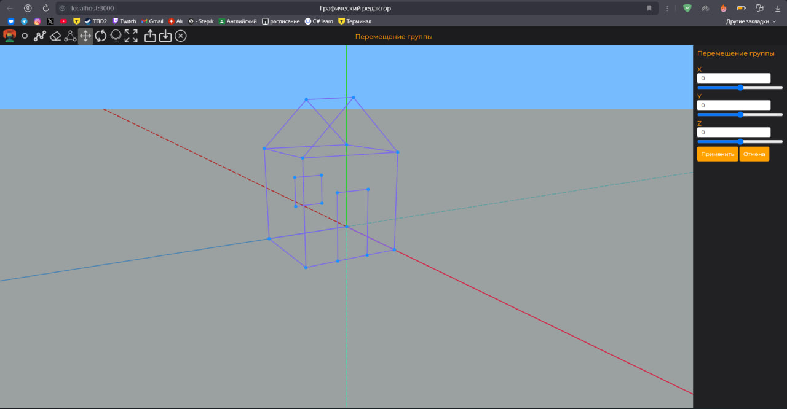
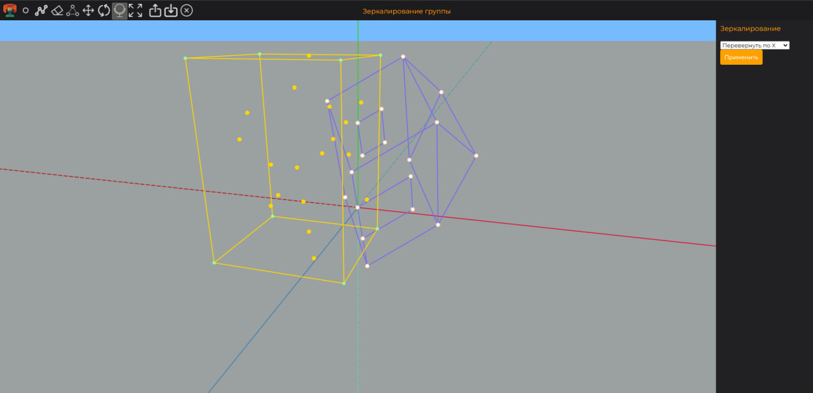

# Графический редактор

* [О проекте](#AboutProject)
* [Используемые технологии](#TechnologiesUsed)
* [Как запустить проект](#StartProject)

## О проекте

Графический редактор, позволяющий создавать и удалять точки и линии между ними. Добавлять точки в группу и проводить над ними операции: сдвига, масштабирования, зеркалирования и поворота. Также можно загрузить и выгрузить.

  
  

## Используемые технологии

Язык: JS
Библа: Konva - для отрисовки

## Как запустить проект (Windows)

1. Установить Node JS (https://nodejs.org/)
2. Скачать проект с GitHub
3. В консоли зайти в папку GraphicEditor3D (в ней лежат файлы package.json и package-lock.json)
4. В консоль ввести команду "npm i" для установки библиотек
5. В консоли ввести команду "npm start" для запуска проекта

а
